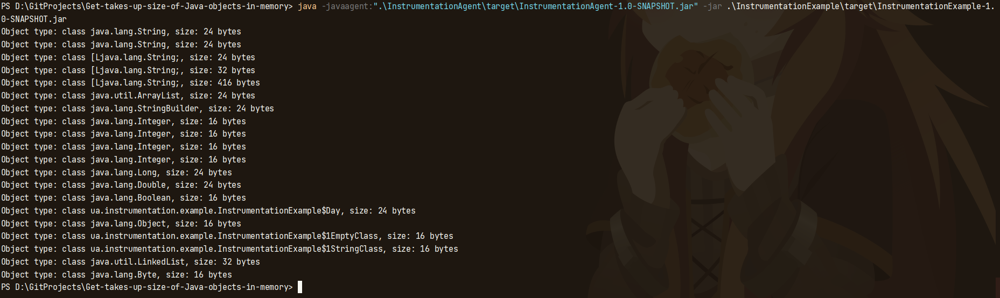

# Way how to get estimated size of Java objects

## List of Contents

- [Description](#description)
- [Project Structure](#project-structure)
- [Usage](#usage)
- [Result](#result)
- [Author Info](#author-info)

---

## Description

### Preview, I hope you enjoy it 😊

Welcome!

This project allow us check how much to find out how much space a Java object takes up in memory.
This is Maven project.<br>
If u want to find detailed instructions click on this [link](https://www.baeldung.com/java-size-of-object).<br>
In this readme I describe [short instructions](#usage) how to run this project into your PC.<br>
If u want known more about [`Instrumentation`](https://www.baeldung.com/java-instrumentation) click on this word.<br>

---

## Project Structure

- The application consists of 2 modules.
- An app modules:
    - `InstrumentationAgent`: In this module exist class was designed to work as a Java agent that can be loaded into a
      Java application to measure the size of objects in memory using the `Instrumentation API`. It's important to
      initialize the globalInstrumentation field with a valid Instrumentation instance using the premain method before
      calling `getObjectSize`;
    - `InstrumentationExample`: This class just show how much a Java object takes up in memory. If u want u can change
      this class.

___

## Usage

1. I recommended u to clone my project from the GitHub.
   <br> If u wanna do this please use this command:

```md  
git clone https://github.com/dima666Sik/Get-takes-up-size-of-Java-objects-in-memory.git
```

2. To run this project you will need to install:
    - JDK 8 or higher;

3. If you continue, u must generate .jar for `InstrumentationAgent` and `InstrumentationExample` as well.<br>
Open terminal and go to those modules and use command below compiles the source code, runs tests, and packages the project into a JAR or other distributable format. It also installs the built artifact into your local Maven repository.

```md
mvn clean install
```
4. To run `InstrumentationExample` u can to return into parent module (using `cd ..`) and use command below. 

```md
java -javaagent:".\InstrumentationAgent\target\InstrumentationAgent-1.0-SNAPSHOT.jar" -jar .\InstrumentationExample\target\InstrumentationExample-1.
0-SNAPSHOT.jar
```
---

## Result

U can see this result if u do all steps right.



## Author Info

- [Linkedin](https://www.linkedin.com)

- [GitHub](https://github.com/dima666Sik)

[Back To The Top](#chatbot-game-v2)